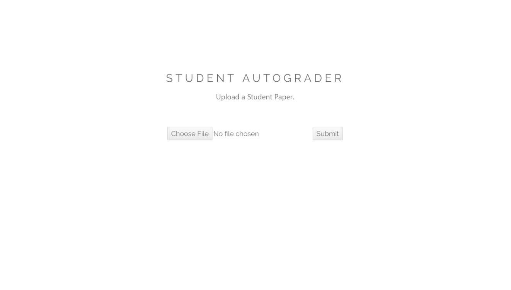
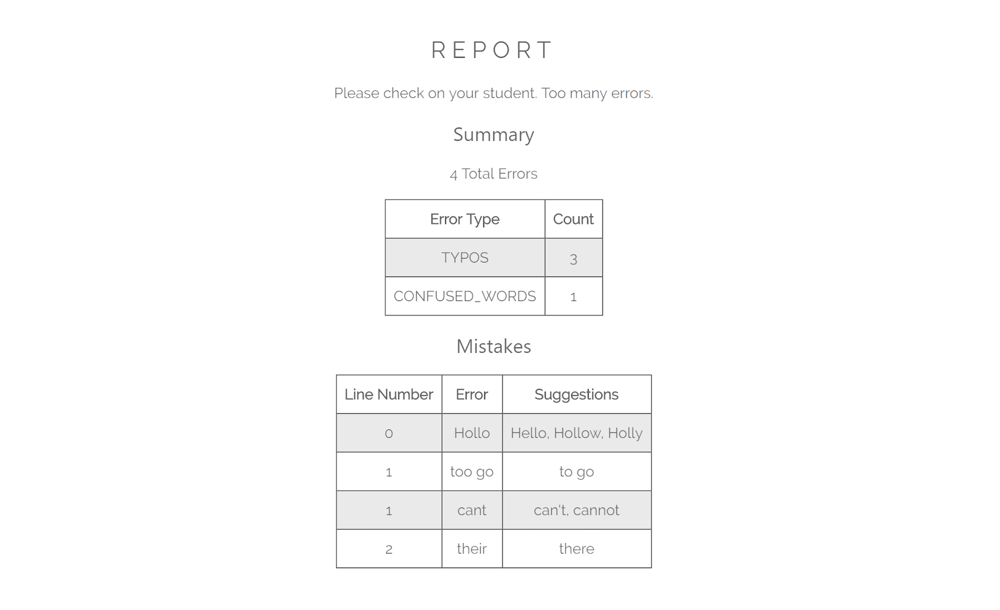

# Grammar Check

Using Microsoft Vision API to detect text, and then GrammarBot API to detect and classify spelling and grammar errors.   

**Upload a student paper.**
 

**Get back a report of errors.**
 
