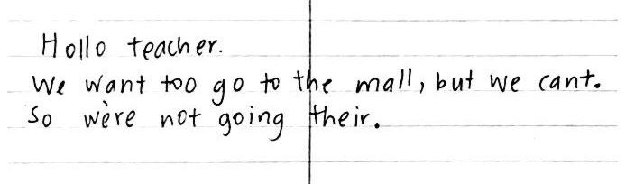
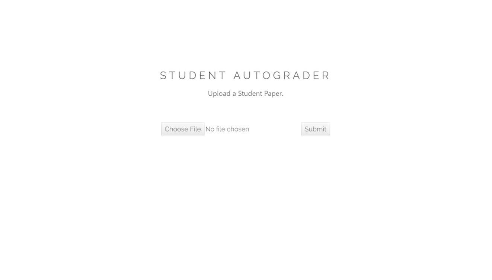
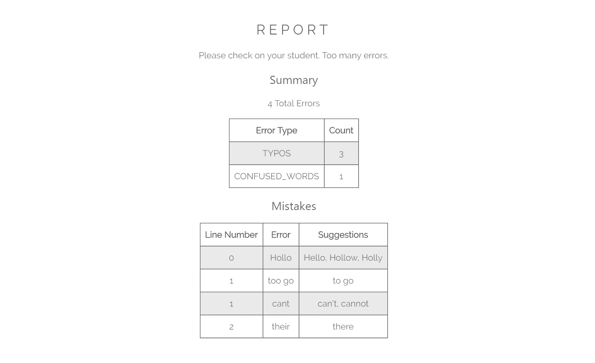

# Grammar Check

Using Microsoft Cognitive Vision API to detect text, and then GrammarBot API to detect and classify spelling and grammar errors.   

**1. Upload a student paper.**

 

**2. Get back a report of errors.**
 
